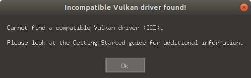
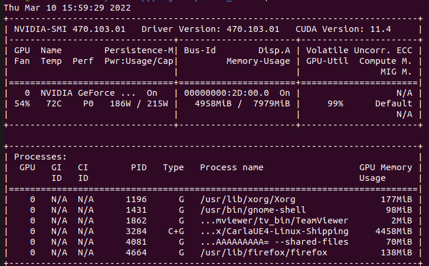

<!--
 Copyright 2023 michael. All rights reserved.
 Use of this source code is governed by a BSD-style
 license that can be found in the LICENSE file.
-->

1. If Vulkan cannot be found on opening

    - Make sure your GPU is configured correctly. 
    - Make sure your Vulkan VK_ICD_FILENAMES is pointed correctly, should be something like 
      - export VK_ICD_FILENAMES=/usr/share/vulkan/icd.d/xxx_icd.x86_64.json

2. If simulation is running really slow
   
    - This is probably because your GPU is not configured correctly. Use `nvidia-smi` to prove that you have Carla running. It should take roughly 4 GB of GPU memory
   

